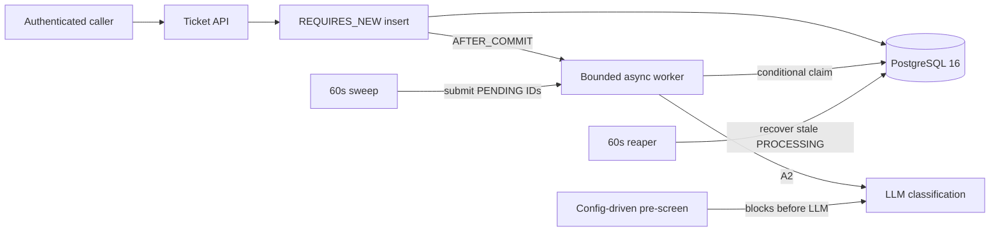

# SupportSense

AI-powered support ticket triage and resolution engine — Spring Boot 3.3 / Java 21 /
Spring AI 1.0 / PostgreSQL 16 + pgvector / Redis. This repository builds **milestone A1
only**: domain model, database schema, JWT auth, and asynchronous ticket ingestion.

SupportSense is a standalone project. It shares no code, no database, and no entities with
any other project. See `.github/artifactory/supportsense-a1-requirements.md` for full scope.

## Repository layout

```
api/          Spring Boot application (Maven)
web/          Angular console (added in milestone A6)
infra/        docker-compose.yml, Terraform (later)
eval/         AI evaluation golden set (added in milestone A6)
docs/         ADRs, architecture notes, metrics definitions
```

## Running locally

### No Docker required for the normal dev loop

Unit tests and `@WebMvcTest` slices run with `mvn test` and require **no Docker and no
external database**.

### Running the application locally

The `local` profile talks to a [Neon](https://neon.tech) free-tier PostgreSQL 16 instance
(supports `CREATE EXTENSION vector`). Set the connection string as an environment variable —
**never commit it**:

```powershell
$env:SPRING_DATASOURCE_URL = "jdbc:postgresql://<your-neon-host>/supportsense?sslmode=require"
$env:SPRING_DATASOURCE_USERNAME = "<user>"
$env:SPRING_DATASOURCE_PASSWORD = "<password>"

cd api
.\mvnw spring-boot:run "-Dspring-boot.run.profiles=local"
```

### Running with Docker (when a container runtime is available)

```powershell
cd infra
docker compose up -d

cd ..\api
.\mvnw spring-boot:run "-Dspring-boot.run.profiles=local"
```

### Proxy notes

If Docker Desktop is installed behind a network proxy, configure the daemon's proxy settings
under **Settings → Resources → Proxies** (or the equivalent `daemon.json` entry), and set
`HTTP_PROXY` / `HTTPS_PROXY` for the Maven Wrapper if dependency downloads fail:

```powershell
$env:MAVEN_OPTS = "-Dhttp.proxyHost=<proxy> -Dhttp.proxyPort=<port>"
```

## Running the full test suite

Integration tests require Docker (Testcontainers, real PostgreSQL — never H2) and run in
CI on every pull request:

```powershell
cd api
.\mvnw verify
```

If Docker is unavailable locally, this only needs to succeed in GitHub Actions — see
`.github/workflows/ci.yml`. A red build publishes the Surefire/Failsafe reports as an
artifact so it is diagnosable without reproducing it locally.

## Architecture

See `.github/artifactory/supportsense-a1-design.md` for the full design and
`docs/adr/README.md` for the decision log.

- **Pattern:** feature-sliced modular monolith with a pure domain core, enforced by ArchUnit
- **Ingestion:** persist-first — the ticket row is committed before async dispatch, so a
  restart or a rejected task never loses work (ADR-0011)
- **Team isolation:** enforced once, in the repository layer, for every ticket read
  (ADR-0006)



## Business-rule test coverage

| Rule | Enforcement | Covering test |
|---|---|---|
| BR-A01 | Persist-first async dispatch, bounded executor, sweep/reaper | `TicketIngestionAfterCommitIT`, `IngestionRejectionIT`, `IngestionClaimConcurrencyIT`, `IngestionReaperIT` |
| BR-A02 | PostgreSQL `ux_ticket_external_ref` | `TicketIdempotencyConcurrencyIT`, `SchemaConstraintsIT` |
| BR-A09 | Pure lifecycle transition map | `TicketStatusTransitionsTest` |
| BR-A10 | Repository `TicketSpecifications.visibleTo` predicate; 404 for inaccessible tickets | `TicketVisibilityIT`, `TicketApiSecurityIT` |
| BR-A12 foundation | Versioned classpath prompt resources | `PromptResourceLoaderTest` |
| Sensitive-topic guard foundation | Configured whole-word pre-screen OR category block | `PreScreenMatcherTest`, `AutoAnswerGateTest` |

## Not yet implemented — A2 scope

- Live LLM classification through Spring AI structured output
- Persisting classification confidence and `TriageResult`
- Confidence calibration and confusion-matrix analytics
- Runtime abstention based on classification confidence, retrieval similarity, and customer tier
- Human triage queue and downstream resolution drafting
- [ ] **Tracked follow-up:** retain clearly non-production local/test credential fixtures until
  deployment configuration is introduced in A2; they are required for deterministic tests and
  must never be reused as deployed credentials.

The A1 pre-screen is intentionally a pure, configuration-driven foundation. It blocks
sensitive terms before any downstream continuation can run, but does not call a model or
write triage outcomes until A2.

### API observability gaps found during E2E design

These were found while writing the black-box journey suite, by attempting to observe real
outcomes through the public API and failing. Each is a limitation for **any** API client,
not merely for a test — a test can reach into the database, a customer integrating against
this API cannot. They are recorded rather than worked around: no journey in the suite uses
repository, `EntityManager`, or service-bean access to compensate for anything listed here.

| # | Journey blocked | Not observable | Why it matters to a real client | Smallest A2 fix |
|---|---|---|---|---|
| **API-F1** | Triage → team assignment | Nothing assigns `team_id`. `TicketIngestionWorker` claims the row, sets `DONE`, and never sets a team. | Every ingested ticket stays team-less, so **no AGENT can ever see a ticket they created** — `visibleTo` is team-scoped, and untriaged+team-less means 404 for all agents. Only ADMIN/LEAD can read anything. The product is unusable for its primary persona until triage lands. | Have the A2 triage step set `category` and `team` before marking `DONE`. |
| **API-F2** | Lifecycle transition | No endpoint mutates `status`. `TicketStatusTransitions.allowedTargets()` has zero production callers — its only consumer is its own unit test. | A client can create tickets and read them but can never progress one. BR-A09 is fully implemented as domain logic and entirely unreachable over HTTP. | `PATCH /api/tickets/{id}/status`, validating against the existing transition map and returning 409 with `allowedTargets` in the ProblemDetail. |
| **API-F3** | Abstention / sensitive-topic routing | `AutoAnswerGate` and `PreScreenMatcher` are wired as beans by `PreScreenConfig` but have **no production caller anywhere**. No code path writes a `triage_results` row, so `abstention_reason` is not merely unexposed — it is never produced. | A client cannot tell whether a ticket was withheld from auto-answer or why. Once auto-answer exists, "why did this not get answered" becomes a primary support question with no answer. | Call the gate from the A2 triage path, persist `TriageResult`, and expose `autoAnswered` plus the abstention reason on the ticket read model. |
| **API-F4** | Failure recovery → fallback team | Reachable only after 3 failed attempts plus a reaper pass. Sweep, reaper, and orphan intervals are `fixedDelay = 60_000` **compile-time constants**, and the stale threshold is 15 minutes — none configurable. There is also no HTTP way to induce a triage failure, because there is no triage. | Operationally invisible: nothing external can confirm the fallback safety net works. It is only ever exercised by tests that call `sweepService.reap()` directly. | Promote the three intervals to `supportsense.ingestion.*` properties so a test profile can compress them, making the recovery path observable end-to-end. |
| **API-F5** | Cross-team visibility setup | No endpoint lists teams or categories, and `RegisterRequest.teamId` silently ignores unknown ids (`findById(...).orElse(null)`). | A client integrating against the API cannot discover a valid `teamId` to register users against, and a wrong guess fails silently as a null team rather than an error. | Either a read-only `GET /api/teams`, or at minimum validate `teamId` and reject unknown values with 400 instead of ignoring them. *(Deliberately not built in A1 — recorded as a finding rather than adding product to satisfy a test.)* |
| **API-F6** | CORS | `SecurityConfig` has no `.cors(...)` configuration and no `CorsConfigurationSource` bean. Spring Security's default is CORS disabled unless explicitly configured. | Harmless today (no browser client exists in A1), but any browser-based caller — including the Angular console due in A6 — will fail CORS preflight until this is configured. | Add an explicit `CorsConfigurationSource` scoped to the known console origin(s) before A6 begins. |
| **API-F7** | Login rate limiting | No lockout, backoff, or attempt-count tracking on `POST /api/auth/login`. `DaoAuthenticationProvider` accepts unlimited attempts. | Reasonable expectation of any login endpoint; absence is a credential-stuffing exposure once the API is internet-reachable. Not a regression — this was never in A1 scope, found during the security config re-audit alongside the 401/403 fix below. | Rate-limit or exponential-backoff `POST /api/auth/login` per IP and/or per account. |

### Fixed during E2E design, not deferred

**Every unauthenticated/invalid-credential request (missing header, expired token, tampered
signature, forged `alg:none`) returned 403 instead of 401.** `SecurityConfig` registered no
`AuthenticationEntryPoint`/`AccessDeniedHandler`, so Spring Security's default
(`Http403ForbiddenEntryPoint`) applied uniformly to both "no credentials" (should be 401 per
RFC 7235) and "authenticated but wrong role" (403, correctly). `JwtAuthenticationFilter`
compounded this by silently clearing the security context on an invalid token instead of
rejecting the request, making an invalid token indistinguishable from no token at all. Found
independently by both models in the blind dual E2E run, then verified against source before
acting. Fixed with an explicit `AuthenticationEntryPoint` (401, generic body, `WWW-Authenticate:
Bearer`) and `AccessDeniedHandler` (403), both returning the same RFC-7807 `ProblemDetail` shape
as `GlobalExceptionHandler`. Covered by `JwtRejectionStatusCodeIT`, including a same-body
assertion across all four rejection modes so a differing body can't become a credential-probing
oracle. Cross-team 404-not-403 and wrong-role 403 were re-verified unaffected by this change.

**Resolved during this phase, not deferred:** `POST /api/tickets` returned 202 while exposing
no way to observe the accepted work's outcome — an incomplete contract independent of testing.
`ingestionState` is now a read-only field on `TicketResponse`, documented in
`src/main/resources/openapi.yaml`, and covered by the contract-drift check. Internal retry
bookkeeping (`attempt_count`, `claimed_at`, `ingestion_error`) remains deliberately unexposed.

## Non-negotiables

1. Every business rule enforced server-side and covered by a test
2. RFC-7807 `ProblemDetail` on every error
3. Flyway migrations, `ddl-auto=validate`
4. Testcontainers, never H2
5. No library outside the locked technology stack
6. No secrets in source
